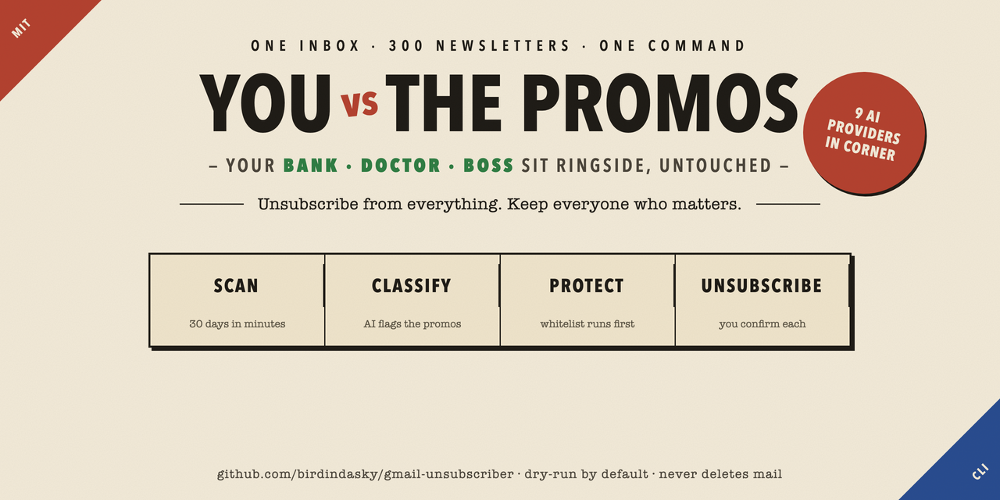
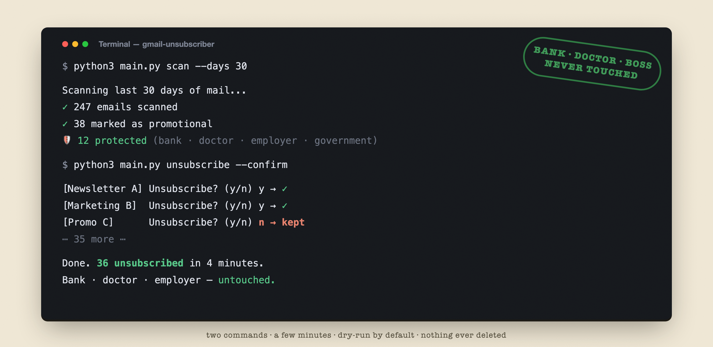
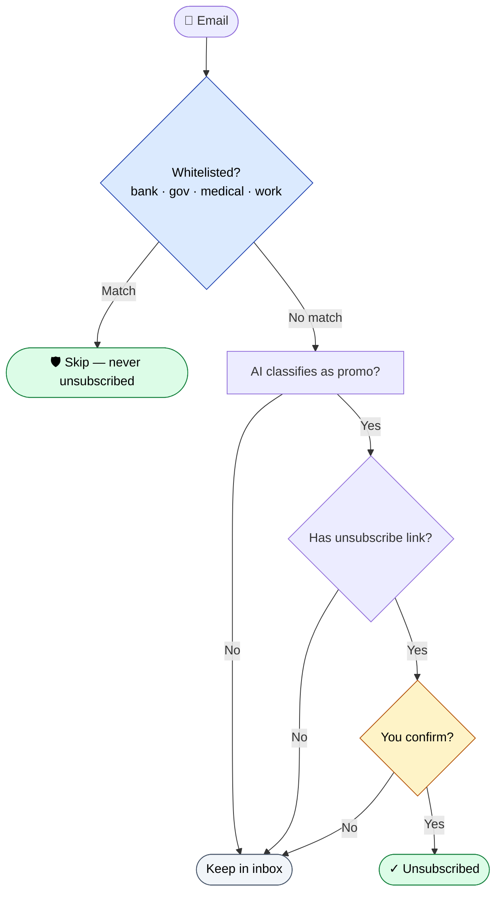

<div align="center">



[](LICENSE)
[](https://www.python.org/)
[](#-ai-support)
[](#)

**English** | [中文](./README_zh.md)

</div>

> Your inbox has 300 unread promotional emails. You've tried unsubscribing one by one — and given up. This tool finishes the job in minutes, while keeping your bank, doctor, and boss safe.

## ✨ How it feels



Two commands. A few minutes. Important senders never touched.

## 🛡️ Safety Features

- **Whitelist first**: banks, Google, government, medical, and other critical senders are always skipped
- **Dry-run by default**: every operation previews before executing — no accidental unsubscribes
- **Never deletes emails**: unsubscribes only; your inbox stays untouched
- **One-by-one confirmation**: each sender is confirmed before action (by default)
- **Full-history safety cap**: `--days 0 --all` processes only the first `2000` messages unless you opt in, so you never accidentally scan an entire mailbox

> 💻 **Platforms**: Mac / Linux / Windows / WSL2 — fully cross-platform. See [USAGE_GUIDE.md](./docs/USAGE_GUIDE.md) for platform-specific command differences between native Windows and WSL2.

## 🧭 How the safety logic works



The whitelist gate runs first. The AI classifier runs second. Your confirmation runs last. Three independent checks before any unsubscribe.

## 🚀 Four-Step Quick Start

```bash
# 1. Enter the project directory
cd /path/to/gmail-unsubscriber

# 2. Create a virtual environment and install dependencies
python3 -m venv venv
source venv/bin/activate
pip install -r requirements.txt

# 3. Obtain Google OAuth credentials
# Follow docs/USAGE_GUIDE.md to complete Google Cloud Console setup
# Place credentials.json in the project root

# 4. First run (opens a browser for authorization)
python3 main.py
```

## 🔧 Runtime Environment

- `Python 3.10+` recommended
- Test dependencies live in `requirements-dev.txt`
- If your system-wide `python3` doesn't have `pytest`, activate the project's virtual environment before running tests:

```bash
source venv/bin/activate
pip install -r requirements-dev.txt
python -m pytest
```

## 📖 Two Ways to Use

### Option 1: Interactive Menu (recommended for beginners)

Run the tool without any arguments and follow the menu:

```bash
python3 main.py
```

The menu walks you through scanning, unsubscribing by category, managing the whitelist, and more.

### Option 2: Command-Line Arguments (power users)

```bash
python3 main.py scan                                    # Scan the last 30 days
python3 main.py scan --days 0                           # Scan all historical promotional emails
python3 main.py scan --days 0 --all                     # Scan all categories, full history (capped at first 2000)
python3 main.py scan --days 0 --all --max-messages 500  # Sample 500 emails across full history
python3 main.py scan --days 0 --all --full-scan         # Explicit full-history scan (no cap)
python3 main.py unsubscribe --dry-run                   # Preview unsubscribes
python3 main.py unsubscribe --confirm                   # Confirm each sender one by one
python3 main.py unsubscribe --confirm --auto            # Auto-unsubscribe all suggestions
```

## 📌 Recommended Usage

- Daily cleanup: `python3 main.py scan --days 30 --no-ai`
- Historical promotions cleanup: `python3 main.py scan --days 0 --no-ai`
- Full-mailbox sampling first: `python3 main.py scan --days 0 --all --max-messages 500 --no-ai`
- Only add `--full-scan` when you explicitly want to scan the entire mailbox

**Rough time estimates (actual numbers depend on network and mailbox size):**
- Scanning ~10,000 emails typically takes around 10–15 minutes; the unsubscribe stage adds a few more minutes
- `--all` is noticeably slower than scanning just the promotions label — sample with `--max-messages 500` first
- Real-world times vary 2–3× depending on network quality, Gmail API rate limits, and AI provider latency

## 🤖 AI Support

Nine AI providers supported (eight built-in + one custom fallback), all configured interactively through the menu — no need to edit environment variables:

**Just run → menu → `5. Settings` → `1. Configure AI Provider`**. Takes about 30 seconds.

Built-in: **OpenAI, Anthropic Claude, MiniMax, DeepSeek, Moonshot (Kimi), Qwen (Tongyi), Zhipu GLM, Ollama**, plus any OpenAI-compatible API (custom entry).

- Config is saved to `user_config.json` (already in `.gitignore`)
- Each sender triggers the AI at most once — results are cached for the run, saving cost
- On first launch, legacy environment-variable configs are migrated automatically
- If no AI is configured, it's simply skipped — core features still work

## 📖 Documentation

- [Full user guide](./docs/USAGE_GUIDE.md) — first-time setup, every command, AI configuration, and FAQ (most detailed)
- [Command cheat sheet](./docs/USAGE.md) — common commands on one page
- [Architecture](./docs/ARCHITECTURE.md) — design and reasoning
- [File overview](./docs/FILE_OVERVIEW.md) — code structure

## ⚠️ Safety Notes

1. **Dry-run is the default**: `--dry-run` never actually unsubscribes
2. **Whitelist protection**: important emails are never unsubscribed
3. **No emails are deleted**: unsubscribing and deleting are independent operations
4. **OAuth-based security**: uses the Gmail API, not IMAP passwords
5. **Full-mailbox opt-in**: `--days 0 --all` processes only the first `2000` messages unless you explicitly add `--full-scan`
6. **Local credential hardening**: `token.json`, `credentials.json`, and `gmail-unsubscriber.db` are automatically set to `0o600` (current-user read/write only); API keys in logs are masked; unsubscribe links are restricted to `http(s)` schemes

---

<div align="center">

**Built by [@birdindasky](https://github.com/birdindasky) · MIT licensed**

⭐ Star if this saved you from clicking 300 unsubscribe links.

</div>
