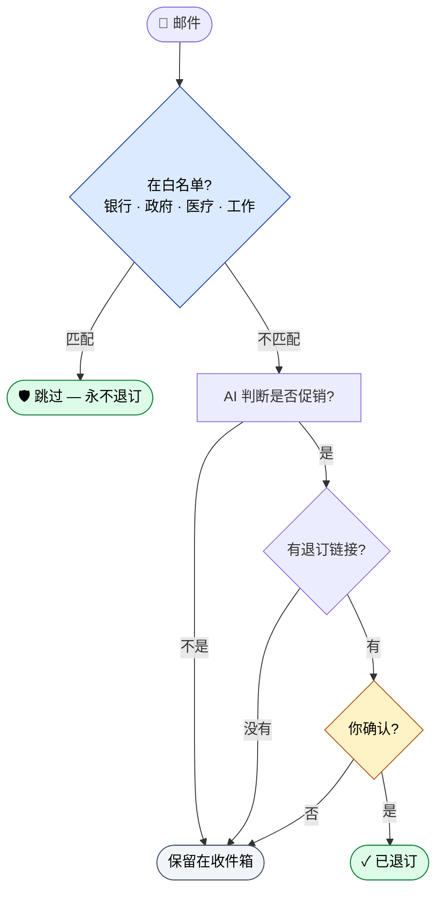

<div align="center">


[](LICENSE)
[](https://www.python.org/)
[](#-ai-支持)
[](#)

[English](./README.md) | **中文**

</div>

> 你的收件箱有 300 封未读促销邮件。你试过一封封退订——然后放弃了。这个工具几分钟内帮你清完,同时让银行、医生、老板的邮件不被碰一下。

## ✨ 用起来什么感觉

```
┌─ 终端 ─────────────────────────────────────────────────────────────┐
│                                                                   │
│  $ python3 main.py scan --days 30                                 │
│                                                                   │
│  扫描最近 30 天邮件...                                              │
│  ✓ 247 封邮件已扫描                                                 │
│  ✓ 38 封识别为促销                                                  │
│  ✓ 12 封受保护(银行 · 医生 · 雇主 · 政府)                          │
│                                                                   │
│  $ python3 main.py unsubscribe --confirm                          │
│                                                                   │
│  [Newsletter A] 退订?  (y/n) y → ✓                                │
│  [Marketing B]  退订?  (y/n) y → ✓                                │
│  [Promo C]      退订?  (y/n) n → 保留                             │
│   ⋯ 还有 35 封 ⋯                                                  │
│                                                                   │
│  完成。4 分钟内退订 36 封。                                         │
│  银行 · 医生 · 雇主 — 完全没动。                                    │
│                                                                   │
└───────────────────────────────────────────────────────────────────┘
```

两个命令。几分钟。重要发件人一封都没动。

## 🛡️ 安全特性

- **白名单优先**：银行、Google、政府、医疗等重要发件人一律跳过
- **默认 dry-run**：所有操作先预览再执行，不会误退订
- **不删除邮件**：只退订，不动收件箱
- **逐个确认**：默认逐个确认每个发件人
- **全历史保护**：`--days 0 --all` 默认只处理前 `2000` 封，避免误跑整箱

> 💻 **支持平台**：Mac / Linux / Windows / WSL2,全平台通用。Windows 原生和 WSL2 的命令差异详见 [USAGE_GUIDE.md](./docs/USAGE_GUIDE.md#2-首次配置只需做一次)。

## 🧭 安全逻辑怎么走



白名单在最前。AI 在中间。你的确认在最后。三道独立闸,任何一道不通过就不会退订。

## 🚀 4 步快速启动

```bash
# 1. 进入项目目录
cd /path/to/gmail-unsubscriber

# 2. 创建虚拟环境并安装依赖
python3 -m venv venv
source venv/bin/activate
pip install -r requirements.txt

# 3. 获取 Google OAuth 凭证
# 参考 docs/USAGE_GUIDE.md 完成 Google Cloud Console 配置
# 将 credentials.json 放入项目根目录

# 4. 首次运行（会弹出浏览器授权）
python3 main.py
```

## 🔧 运行环境

- 推荐 `Python 3.10+`
- 测试依赖在 `requirements-dev.txt`
- 如果本机默认 `python3` 里没有 `pytest`，请先激活项目虚拟环境再执行测试

```bash
source venv/bin/activate
pip install -r requirements-dev.txt
python -m pytest
```

## 📖 两种使用方式

### 方式一：交互式菜单（推荐新手）

直接运行，跟着菜单操作：

```bash
python3 main.py
```

菜单会引导你完成扫描、按类别退订、管理白名单等操作。

### 方式二：命令行参数（高级用户）

```bash
python3 main.py scan                              # 扫描最近 30 天
python3 main.py scan --days 0                     # 扫全部历史促销邮件
python3 main.py scan --days 0 --all               # 扫全部历史邮件（默认保护到前 2000 封）
python3 main.py scan --days 0 --all --max-messages 500  # 全历史先抽样 500 封
python3 main.py scan --days 0 --all --full-scan   # 明确执行全历史完整扫描
python3 main.py unsubscribe --dry-run             # 预览退订
python3 main.py unsubscribe --confirm             # 逐个确认退订
python3 main.py unsubscribe --confirm --auto      # 自动退订全部
```

## 📌 推荐用法

- 日常清理：`python3 main.py scan --days 30 --no-ai`
- 历史促销清理：`python3 main.py scan --days 0 --no-ai`
- 全邮箱排查先抽样：`python3 main.py scan --days 0 --all --max-messages 500 --no-ai`
- 只有在您明确要扫完整个邮箱时，再加：`--full-scan`

**时间预期（经验值，具体取决于网络和邮箱规模）：**
- 扫描 1 万封邮件通常需要十几分钟，退订阶段再加几分钟
- `--all` 比只扫促销标签明显更慢，建议先 `--max-messages 500` 抽样
- 实际时间受网络质量、Gmail API 限流、AI 提供商响应速度影响，差异可能在 2~3 倍区间

## 🤖 AI 支持

支持 9 家 AI 提供商（8 家内置 + 1 个自定义兜底），通过菜单交互式配置（无需改环境变量）：

**直接运行 → 菜单 → 5. 设置 → 1. 配置 AI 提供商**，30 秒搞定。

内置支持：**OpenAI、Anthropic Claude、MiniMax、DeepSeek、Moonshot(Kimi)、通义千问、智谱 GLM、Ollama**，以及任何 OpenAI 兼容接口（自定义入口）。

- 配置保存在 `user_config.json`（已加入 `.gitignore`）
- 同一发件人只调用一次 AI（结果缓存到运行结束），节省费用
- 首次启动会自动从环境变量迁移老配置，无感升级
- 未配置 AI 时自动跳过，不影响基本功能

## 📖 文档

- [完整使用手册](./docs/USAGE_GUIDE.md) - 首次配置、所有命令、AI 配置、常见问题（最详细）
- [命令速查表](./docs/USAGE.md) - 常用命令一页纸速查
- [架构设计](./docs/ARCHITECTURE.md) - 设计与思路
- [文件说明](./docs/FILE_OVERVIEW.md) - 代码结构

## ⚠️ 安全提示

1. **默认是预览模式**：`--dry-run` 不会真正退订
2. **白名单机制**：重要邮件不会被退订
3. **不删除任何邮件**：退订和删除是独立操作
4. **OAuth 安全**：使用 Gmail API 而非 IMAP 密码
5. **全历史全邮箱默认保护**：`--days 0 --all` 默认只处理前 `2000` 封；如需完整扫描，必须显式加 `--full-scan`
6. **本地凭据文件权限收紧**：`token.json`、`credentials.json`、`gmail-unsubscriber.db` 均自动设置为 `0o600`（仅当前用户可读写），日志里的 API Key 会被遮蔽，退订链接仅接受 `http(s)` 协议

---

<div align="center">

**作者 [@birdindasky](https://github.com/birdindasky) · MIT 协议**

⭐ 如果这工具帮你省下点 300 次"取消订阅"按钮的时间,star 一下吧。

</div>
