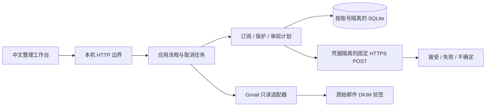

# 轻邮 v2：架构与安全边界

v2 是本机浏览器应用。核心任务是让用户看清有哪些订阅、保留重要内容、明确选择后提交退订请求，并保留可核对的结果。默认演示与真实账号完全分开。

| 模块 | 责任 | 不拥有的权限 |
|---|---|---|
| `web/` | 列表、保护、详情、预览、结果、进度 | 不能从浏览器传入任意执行 URL 或伪造 authenticated |
| `server.py` | 精确 Host/Origin、会话令牌、JSON边界、固定静态文件 | 不替用户授权 Gmail，不记录请求内容 |
| `application.py` | 连接、受限扫描、预览前验签、单作业协调、演示隔离 | 不能绕过领域的保护和计划检查 |
| `core.py` | 订阅身份、保护规则、计划版本、幂等执行、持久化 | 不访问 Gmail；只能调用显式注入的退订传输 |
| `gmail.py` | 用户明确连接后读取 Gmail；metadata规范化、raw验签 | 不发邮件、不删除、归档或修改标签、不退订 |
| `network.py` | 公网HTTPS地址检查、固定IP连接、TLS主机校验、固定POST | 不读netrc、不继承环境代理认证、不跟随跳转、不重试 |
| `runtime.py` | 数据目录的进程锁，阻止两个实例同时操作同一库 | 不改变系统服务或启动项 |
| `demo.py` | 明确标识的合成邮件与模拟回执 | 没有真实网络调用 |

采用标准库 HTTP 服务、SQLite 和原生 ES modules 是为了减少本机运行负担。前后端、领域策略和外部适配器通过明确接口连接；不把多个程序或常驻服务作为小型个人应用的前提。

## 身份与状态

- 账号在连接后由真实 Gmail profile 得到，按账号隔离订阅与历史。
- 优先采用发件地址与 List-ID 形成订阅身份；缺少 List-ID 时保守绑定具体退订目标。List-ID 是分组线索，不是可信身份凭证。
- 扫描逐条隔离不支持的格式与身份冲突，保留有效邮件并显示部分结果；数据库故障仍原子回滚。
- 同一数据目录使用操作系统进程锁，仅允许一个应用实例。
- 新扫描按邮件 ID 更新，不重复累计；一次接受请求不意味着该发件人其他列表都已处理，新来信仍可保留。
- 预览计划绑定选中订阅、当前版本和保护修订，5 分钟过期。不是把浏览器传入的任意 URL 当执行任务。
- 外发前提交 pending 记录；进程中断遗留请求记为 uncertain，不静默重试。已完成计划重复提交返回已有回执。
- 保护规则在真正发送前复检，界面缓存不能凌驾于当前保护。

## 外部请求的信任链

扫描使用 `gmail.readonly`，因为 metadata scope 不支持本项目的搜索和 raw取件。metadata 中看到 `Authentication-Results: dkim=pass` 仍不可信；预览选中订阅时按需读取原始字节，用 dkimpy 验证同一个签名确实覆盖 From 和两条退订头。关键头重复、不能验证、缺少依赖等情况均保守转人工，绝不把字符串当作验签证明。[Google scopes](https://developers.google.com/workspace/gmail/api/auth/scopes)、[RFC 8058 §4](https://www.rfc-editor.org/rfc/rfc8058.html#section-4)、[RFC 8601 §7.1](https://www.rfc-editor.org/rfc/rfc8601.html#section-7.1)

执行器仅对经检查的一键 URL 发送固定 POST。解析后的每个IP必须为公网地址，再把连接固定到已检查的IP，同时以原域名验证 TLS。普通网页、mailto、正文里的 cancel/remove 等链接不自动请求，人工处理入口只打开 Gmail 对应邮件。

服务器 2xx 只记录“请求已接受”。HTML网页、跳转、发送后超时等标记不确定，保留人工核实入口。请求被接受不等于发送方永远停止邮件。[RFC 8058](https://www.rfc-editor.org/rfc/rfc8058.html)

## 新旧版本

旧Python模块暂留作历史审查和原测试的对象，`main.py` 的命令行入口已转向 v2。v2 不导入旧扫描器、分类器、退订执行器或数据库，也不把旧库中的成功状态迁移为可信完成。

新账号数据写在 `.local/v2-live/`，演示数据写在 `.local/v2-demo/`；目录0700，数据库和新token为0600。旧凭据只在用户明确连接且指定为OAuth客户端文件时读取，旧token不自动复用。应用不安装登录启动项，不开启计划任务，终端关闭即停止。

## 验证边界

离线测试能证明决策、状态、模拟网络和数据库行为，不能证明真实 Gmail 授权成功、真实退订方接受或长期停信。真实试用记录只保存在使用者本机，不随公开代码发布。

## P1 作业与增量保存

核验和执行的HTTP入口立即返回202与job_id，state轮询提供逐项进度；后台任务只在用户操作后启动。停止保留在途结果，不把取消说成撤回。执行前持久化pending后释放数据库锁再发送，因此慢传输期间进度和保护更新仍可读取；每一下一项重新检查保护/取消/去重。

扫描每20封或分页结束事务保存，当前批次邮件和累计计数一起提交；故障回滚当前批次。扫描范围、开始结束时间和终止原因存入现有accounts.scan JSON；旧JSON缺字段保守推导，不重建数据库。重启只恢复中断标记与既有数据，连回相同账号后才能查看，不自动访问Gmail。
